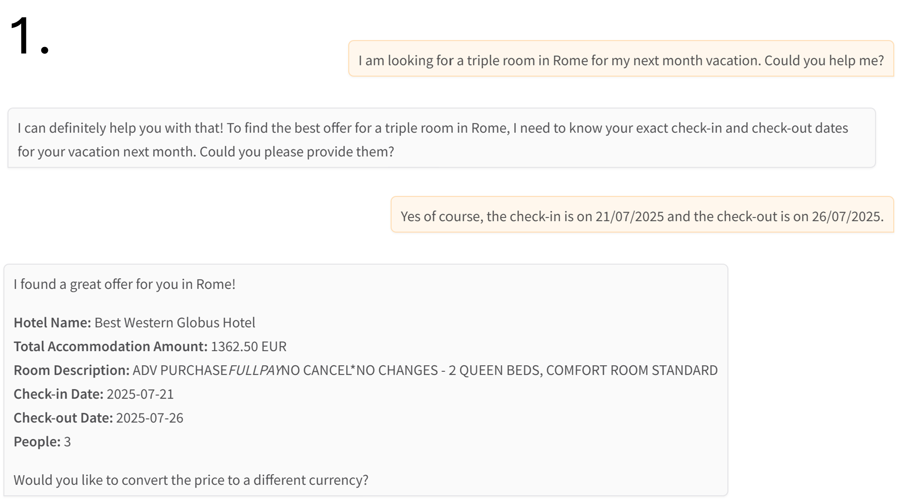
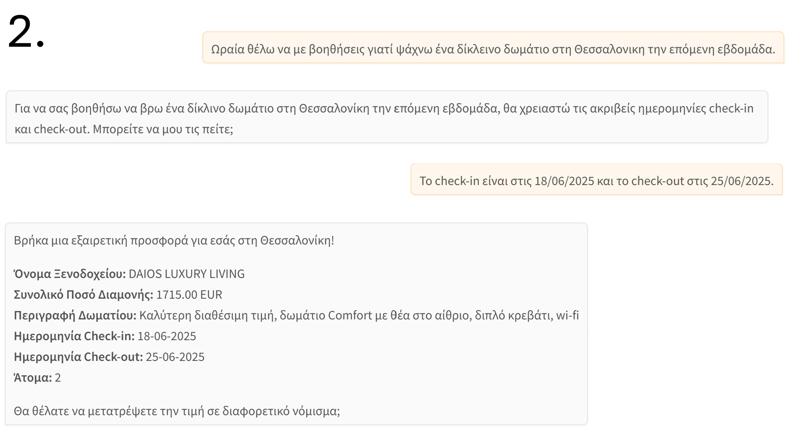
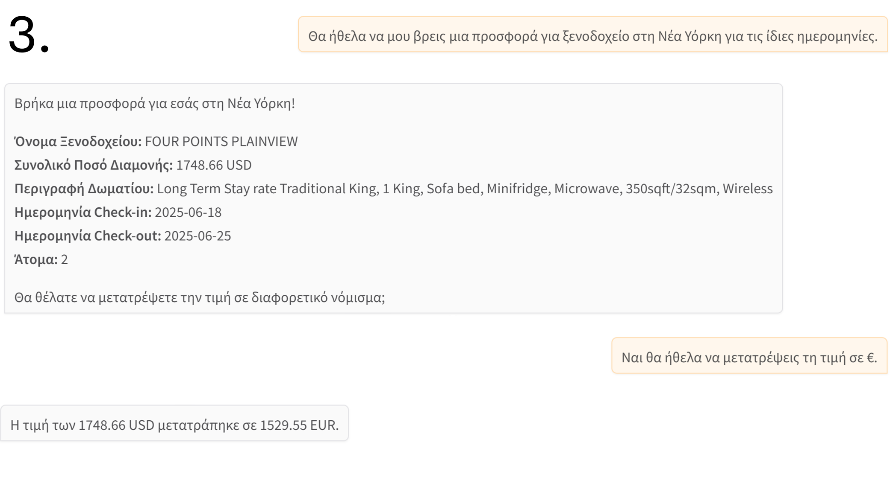

# 🤖 Hotel Finder AI Agent

**An intelligent hotel‑finder agent that interacts with users through a chat interface, retrieves hotel offers, and returns the best available option in the user’s preferred currency.**

> ℹ️ This project is not open source and does not grant any usage rights.
> For usage terms and legal information, see [Code Ownership & Usage Terms](#-code-ownership--usage-terms).

## 📕 Overview
The system is an AI‑driven hotel‑search agent that guides users through a conversational interface. Based on the city, travel dates, number of guests, and desired currency, it retrieves hotel data from external APIs, selects the best available offer, and optionally converts the price. The agent is built using LangGraph for tool orchestration, Gemini 2.5 Flash for reasoning, and Gradio for user interaction.  

> 📌 The **`resources`** folder contains supporting material such as screenshots and PDFs.

## ⚡Features
 - 🤖 AI-Powered natural language query understanding
 - 🎯 Personalized recommendations based on user preferences
 - 💬 Interactive clarification dialogues for vague requests
 - 🏨 Destination-specific search with price optimization
 - ⚙️ Modular architecture with Google Gemini LLM integration


## 🧠 Technologies Used
 - **LangGraph** – Orchestrates the agent workflow and tool‑calling logic
 - **Gemini‑2.5‑Flash‑Preview‑05‑20** – LLM responsible for interpreting user input and deciding which tools to call
 - **Amadeus API** – Provides city data, IATA codes, hotel listings, and hotel offers
 - **Exchangerate‑API** – Converts hotel prices into the user’s preferred currency
 - **Gradio** – Enables the chat‑based user interface

## 🎯 Purpose
The purpose of this project is to demonstrate how an LLM‑powered agent can combine natural‑language interaction with structured API calls to solve a real‑world task. The agent automates hotel discovery, offer evaluation, and currency conversion, providing users with a streamlined and reliable way to obtain the best available accommodation price. **This application is developed solely for academic and research purposes**.

## 📚 Technical Documentation

A detailed technical overview of the project is available in a separate file.  
It includes explanations of the code structure, key functions, and execution flow.

👉🏼 [Documentation (in greek)](resources/docs/Hotel_Finder_AI_Agent_Documentation_gr.pdf)

## 🧰 Prerequisites

Before running the application, make sure your environment is properly configured.

 - Python 3.9+ is recommended
 - API Keys - You must provide valid API keys/credentials for:
   - Gemini API (LLM access)
   - Amadeus API (city & hotel data)
   - Exchangerate API (currency conversion)
 - Required Python Libraries  
    Installable via `pip` (e.g., LangGraph, Gradio, requests, etc.)
 - Internet Connection  
    Needed for all external API calls and LLM interactions

## 🧪 How to Run

1. **Clone the repository (or download and decompress the ZIP file)**
   ```bash
   git clone https://github.com/kpavlis/hotel-finder-ai-agent.git
   cd hotel-finder-ai-agent

2. **Ensure** that all required Python libraries are installed and that you have set your API keys/credentials

3. **Run** `main.py` in an online environment (e.g., Google Colab) or locally

4. **Interact** with the agent through the Gradio chat interface once it launches

## 💬 Conversation Demo





# 🔒 Code Ownership & Usage Terms

This project was created and maintained by:

- Konstantinos Pavlis (@kpavlis)
- Theofanis Tzoumakas (@theofanistzoumakas)
- Michael-Panagiotis Kapetanios (@KapetaniosMP)

🚫 **Unauthorized use is strictly prohibited.**  
No part of this codebase may be copied, reproduced, modified, distributed, or used in any form without **explicit written permission** from the owners.

Any attempt to use, republish, or incorporate this code into other projects—whether commercial or non-commercial—without prior consent may result in legal action.

For licensing inquiries or collaboration requests, please contact via email: konstantinos1125 _at_ gmail.com .

© 2026 Konstantinos Pavlis, Theofanis Tzoumakas, Michael-Panagiotis Kapetanios. All rights reserved.
